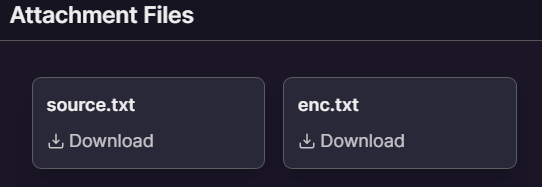

# Happy Valentine's Day 
`Difficulty: Easy`

**DESCRIPTION**<br>
My girlfriend and I captured our best moments of Valentine's Day in a portable graphics network. But unfortunately I am not able to open it as I accidentally ended up encrypting it. Can you help me get my memories back?

Author : Pushkar Deore

FLAG FORMAT: `VishwaCTF{}`



## Solution:

Here i got Python source file of encryption and the encrypted text file

i used encryption code to make decryption code using chatgpt and i got this

after understanding the i got to know that the it is using original.png (this any proper png file) to get the key to decrypt the ciphertext

and after runnig this i got this image named `decrypted.png`

```python
from PIL import Image
from itertools import cycle

def xor(a, b):
    return [i ^ j for i, j in zip(a, cycle(b))]

# Read the encrypted data from the "enc.txt" file
encrypted_data = bytearray(open("enc.txt", "rb").read())

# Read the original PNG file to obtain the encryption key
original_data = open("original.png", "rb").read()
key = [original_data[0], original_data[1], original_data[2], original_data[3], original_data[4], original_data[5], original_data[6], original_data[7]]

# Perform XOR operation again to decrypt the data
decrypted_data = bytearray(xor(encrypted_data, key))

# Write the decrypted data to a new file
with open("decrypted.png", "wb") as f:
    f.write(decrypted_data)
```


and here i got the flag `VishwaCTF{h3ad3r5_f0r_w1nn3r5}`