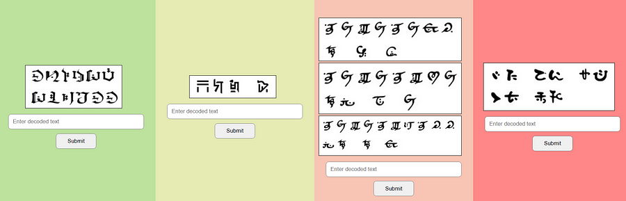
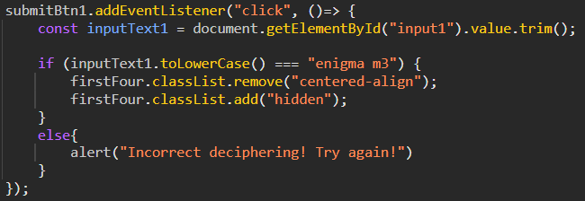
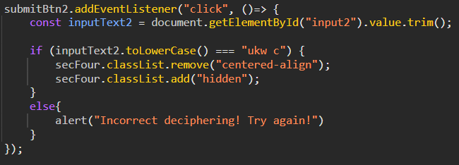
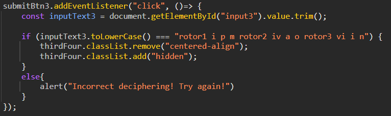
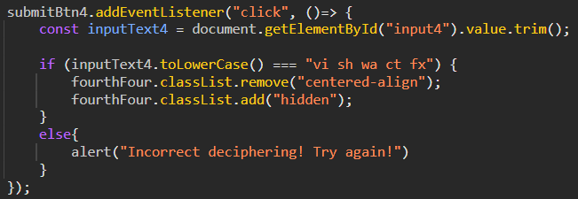
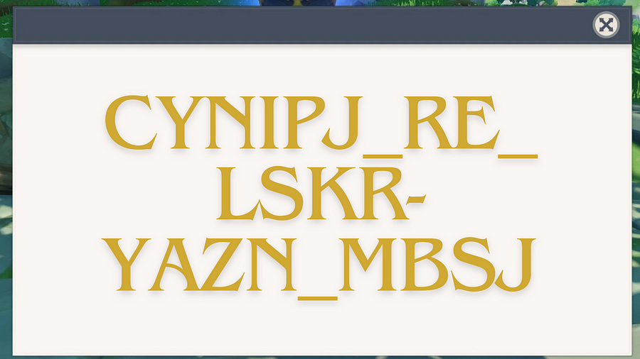
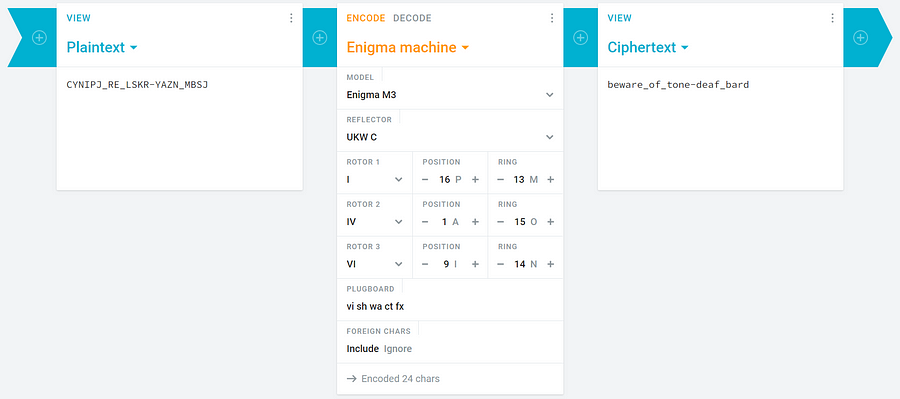

# Teyvat Tales
`Difficulty: Medium`


DESCRIPTION
All tavern owners in Mondstadt are really worried because of the frequent thefts in the Dawn Winery cellars. The Adventurers’ Guild has decided to secure the cellar door passwords using a special cipher device. But the cipher device itself requires various specifications….which the guild decided to find out by touring the entire Teyvat.

PS: The Guild started from the sands of Deshret then travelled through the forests of Sumeru and finally to the cherry blossoms of Inazuma

Author: Amruta Patil

FLAG FORMAT: `VishwaCTF{}`



## Solution:


First i decrypted using different scripts but later i found all in the `script.js` in inspect


`enigma m3`
<br><br>


`ukw c`
<br><br>


`rotor1 i p m rotor2 iv a o rotor3 vi i n`
<br><br>


`vi sh wa ct fx`
<br><br>


`CYNIPJ_RE_LSKR-YAZN_MBSJ`
<br><br>

the decoded text is:
```
enigma m3
ukw c
rotor1 i p m rotor2 iv a o rotor3 vi i n
vi sh wa ct fx
```
Fromt the first decoded text i got an idea about enigma m3 machine


After using all these decryptions in enigma machine and using in [cryptii](https://cryptii.com/pipes/enigma-machine) site
i got the flag


`beware_of_tone-deaf_bard`

So we got the flag

### Flag:
`VishwaCTF(beware_of_tone-deaf_bard)`
