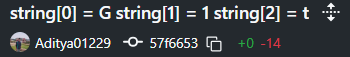
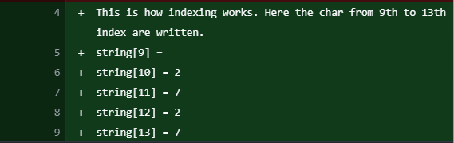
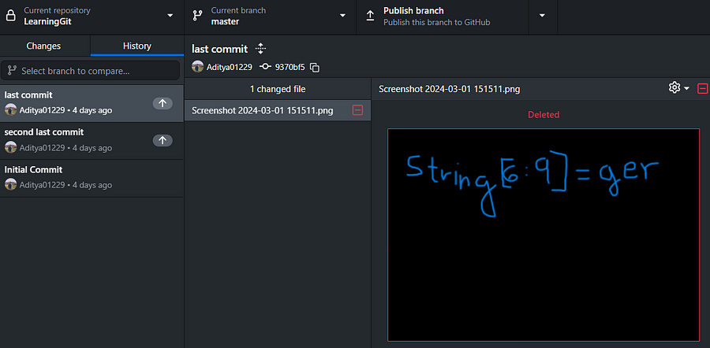
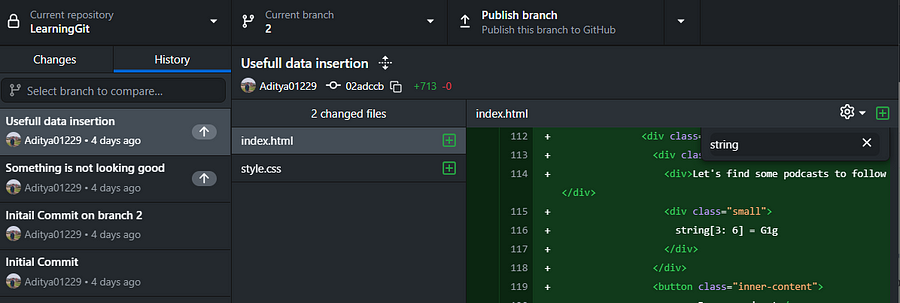

# Repo Riddles
`Difficulty: Medium`

DESCRIPTION
We got a suspicious Linkedin post which got a description and also a zip file with it. It is suspected that a message is hidden in there. Can you find it?

LinkedIn Post Description:

Title: My First Project -The Journey Begins

Hello fellow developers and curious minds!

I'm thrilled to share with you my very first Git project - a labor of love, dedication, and countless late-night commits. 🚀

Explore the code, unearth its nuances, and let me know your thoughts. Your feedback is invaluable and will contribute to the ongoing evolution of this project.

Author : Aditya Jasoriya

FLAG FORMAT: `VishwaCTF{}`


## Solution:

We got the folder as an attachment so I openend it in github desktop. After I opened it, I checked the history of branches and got this.

In branch 3 history, I got the 1st and 4th part of the flag.





In master branch, I found this image and got the 3rd part of the flag



On searching in branch 2 history I found index.html file, which contained the 2nd part of the flag



So combining all these clues (index values) I got the flag

```
string[0] = G
string[1] = 1 
string[2] = t
string[3: 6] = G1g
string[6:9] = ger
string[9] = _
string[10] = 2
string[11] = 7
string[12] = 2
string[13] = 7
```
### Flag:
`VishwaCTF{G1tG1gger_2727}`