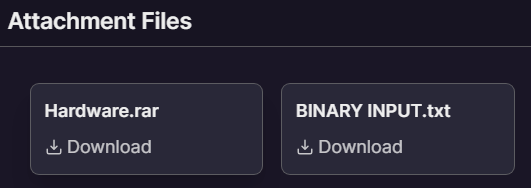
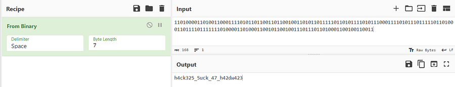

# HARDWARE HEIST
`Difficulty: Easy`

DESCRIPTION
Your cyber gang has stolen a hardware device code from the CIA but are unable to use it. Although while stealing the code, you have found some binary strings which might be helpful to understand the device. You might even find the important codes after solving the device and strings.

Author : Pushkar Deore

FLAG FORMAT: `VishwaCTF{}`



## Solution:

Got this in a `BINARY INPUT.txt`

```binary
110100001101001100011110101101100110110010011010110111110110101111010111000111101011101111101101000110111101111111010000110100011001011001001110111011010001100100110011
```
after converting this in a [cyber chef](https://gchq.github.io/CyberChef/) i got this



`h4ck325_5uck_47_h42dw423`

### Flag:
`VishwaCTF{h4ck325_5uck_47_h42dw423}`