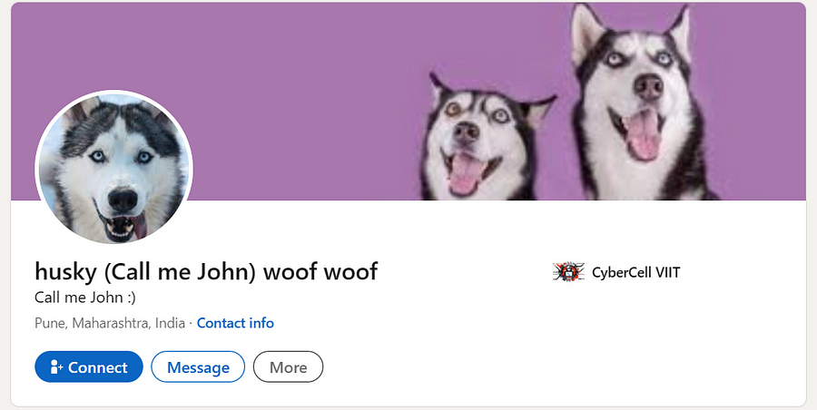

# Cyber Pursuit Manhunt
`Difficulty: Hard`

**DESCRIPTION** 
In response to alarming reports, our cybersecurity team is actively pursuing a hacker known by the alias "h3ck3r_h3_bh41", who poses a serious threat by extorting innocent individuals for monetary gain. Your mission is to track down this hacker and provide us with the crucial information needed to apprehend them.

Retrieve the Hacker's complete full name (first name, middle name, last name), formatted in lowercase and replacing spaces with underscores, along with the associated website domain.

Author : Pranit Govande

FLAG FORMAT: `VishwaCTF{full_name_domain.in}`

## Solution:

here name was given "`h3ck3r_h3_bh41`" i searched in different social media platform and after searching on X(Twitter) i got this

*Link: https://twitter.com/h3ck3r_h3_bh41*

After observing the latest post I searched `Cookie the baby chick` on many social media platforms

And Finally I found an account on Instagram with the name “`cookiethebabychick`”

I checked the followers, from where I got the account of `simon_j_peter`

In the caption of one of the post, I found the youtube [link](http://bit.ly/3v79BgB)

The name of the Youtube channel was “`husky woof woof`”,there were no any other informations present. So I tried to find husky woof woof named account on social media

I found the `husky woof woof` on LinkedIn
and from there i got the middle name 
 
 So i got the name that is “`simon_john_peter`”, now i have to find domain name
 
 

 
 
 On searching through one of its post, I found another URL “https://lnkd.in/dPQQxyyr”, which was of an image

 

 Using [Aperisolve](https://www.aperisolve.com/) i checked the metadata and i found some location

which i checked on [this](https://www.gps-coordinates.net/) and got chandrapur,Maharashtra.

 

 By seeing picture of Tiger in the image i got hint to search tiger reserve in chandrapur, and after searching i got this

 

 And from here I got the domain name from “https://www.`tadobanationalpark.in`”

 Combining name and domain i got the flag

 ### Flag: 
`VishwaCTF{simon_john_peter_tadobanationalpark.in}` 

