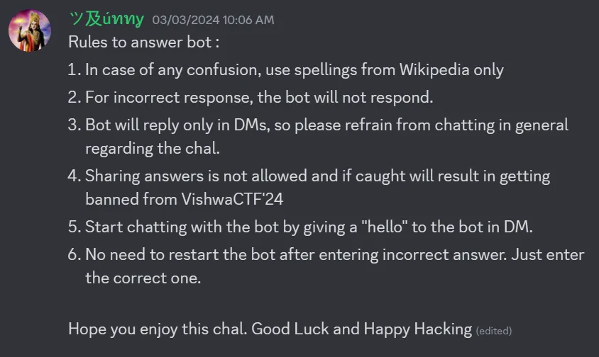

# Sagar Sangram
`Difficulty: Medium`

**DESCRIPTION**<br>
Once upon a time there were 2 groups, one was known for being on positive side and other on negative side. Both the groups wanted to be immortal and hence required a divine potion for it. So they decided to "Churn the Ocean" to get the divine potion.

It's a wonderful event written in some of the ancient scriptures. Hop on to the server and have a chat with bot, maybe he'll give you the flag.

[Join Server](https://discord.com/invite/XWuMMwFA)

Author : Ankush Kaudi

FLAG FORMAT: `VishwaCTF{}`

### Solution:

Joined the Server from the link provided.



by reading the rules I got to know that we have to msg bot to proceed further


Then I messaged the bot `VedicTriviaBot#0537`

To start the conversation, send hello to bot’s DM as mentioned in a rules

after that the bot asked 10 questions and then we get the flag

The following are the question-answers.

```
Q1 of 10 : So it was decided, to obtain the divine potion of immortality, churning of the ocean is to be performed. For that purpose a huge mountain was used. Tell me what is the name of the mountain and also which ocean was churned to obtain the potion of immortality?
```
`KshiraSagara_Mandara`
<br><br><br>

```
Q2 of 10 : Let’s get step back. Mount Mandara was used in churning. But it was not just around the ocean. It was brought there by someone. So, who brought Mount Mandara to Kshirasagara?
```
`garuda`
<br><br><br>

```
Q3 of 10 : Now the stage is set but to churn the ocean, something was required which both the groups would hold and churn. Who was used like a rope to churn the ocean Kshirasagara?
```
`vasuki`
<br><br><br>

```
Q4 of 10 : The process starts and the outcomes begin to appear. One such outcome was a very threatening substance, which had the power to destroy the whole universe. But ‘The Ultimate Destroyer’ comes to rescue and consumed it, which results in his throat turning blue hence he is also called ‘Neelakantha’. What is the substance called?
```
`Halahala`
<br><br><br>

```
Q5 of 10 : Let’s talk about few more outcomes. One such divine outcome was a tree. It was taken to the abode of Indra in swarga. It is often referred to as ‘Wish Fulfilling Tree’ as it possess the power to bring one’s imagination into reality. Tell me the name of this tree?
```
`Kalpavriksha`
<br><br><br>

```
Q6 of 10 : Another creature appeared was a very powerful elephant which was taken by Lord Indra as his medium of transportation. It was very powerful elephant and also referred sometimes as ‘King of Elephants’. What is the name of that elephant?
```
`Airavata`
<br><br><br>

```
Q7 of 10 : After a while during the process, a bow appeared during the churning. It was given to Lord Vishnu as a weapon. What is the name of that divine bow?
```
`Sharanga`
<br><br><br>

```
Q8 of 10 : In ancient times as mentioned in the scriptures, conch was used as a sign to initiate a war between two groups (also used for other purposes as well). Different persons from both the sides would blow the conch which will mark the start of the war. During the churning, one such conch was obtained and it was given to Lord Vishnu. It’s sound symbolizes the ‘Sound of Creation’. What is the name of the conch?
```
`Panchajanya`
<br><br><br>

```
Q9 of 10 : The fortunes turned as the goddess of fortune herself appeared. Every wanted the goddess of fortune to be at their side, but the destiny has it’s own plan. She chose Lord Vishnu as her eternal consort.. Who is the goddess of fortune?
```
`Lakshmi`
<br><br><br>

```
Q10 of 10 : Ok, let’s end this thing. After all the struggle from both the sides, the long wait comes to an end. The divine potion is here and it is brought by none other than the physician of the devas. He is also referred to as ‘God of Ayurveda’. Tell me his name and also the name of divine potion? Ans format : name of the physician_name of divine potion
```
`Dhanvantari_Amrita`
<br><br><br>

```
Impressive. A perfect 10/10. You are one the who deserves the flag. Just one last thing. All the event which is I asked you about is very popular and is mentioned in various scriptures like Vishnu Purana, Mahabharata, etc. Can you tell me what this event is popularly known as?Use _ in place of any space
```
`Samudra_Manthana`
<br><br>


By answering all questions correctly, I got the flag.

### Flag:
`VishwaCTF{karmany-evadhikaras te ma phaleshu kadachana ma karma-phala-hetur bhur ma te sango stvakarmani}`