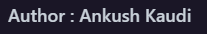
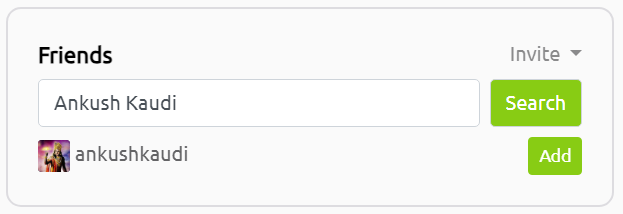
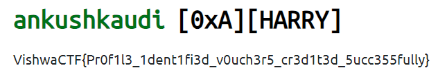

# TRYHACKME 
`Difficulty: Medium`

**DESCRIPTION:**  
TryHackMe is a browser-based cyber security training platform, with learning content covering all skill levels from the complete beginner to the seasoned hacker.

One of our team member is very active on the platform. Recently, I got to know that he comes under 3% in the global leaderboard. Impressive isn't it.

Maybe you should have a look at his profile

PS : He keeps his digital identity very simple. No fancy usernames. It's just a simple mathematics

His real name == His username

Author : Amruta Patil

FLAG FORMAT: `VishwaCTF{}`

## Solution: 

In this challenge it was said that the person is one of team member so i searched for the autors of the different challenges and found this

and after searching name and then searching on tryhackme this name worked

and after searching on tryhackme friends search i got his username

then i searched his usename and got this

and here i got the flag

### Flag:
`VishwaCTF{Pr0f1l3_1dent1fi3d_v0uch3r5_cr3d1t3d_5ucc355fully}`
