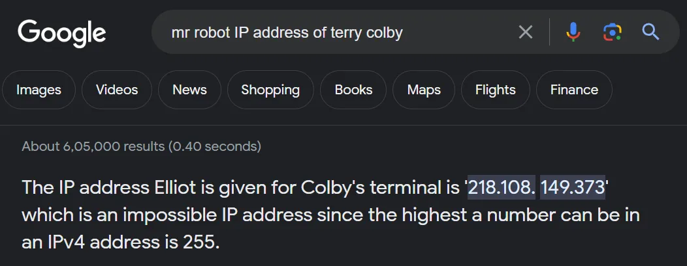
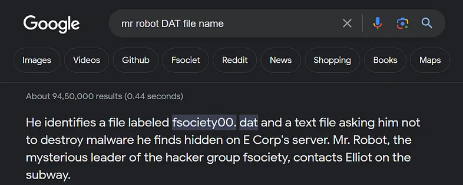

# ifconfig_inet
`Difficulty: Medium`

**DESCRIPTION** 
In the labyrinth of binary shadows, Elliot finds himself standing at the crossroads of justice and chaos. Mr. Robot, the enigmatic leader of the clandestine hacktivist group, has just unleashed a digital storm upon Evil Corp's fortress. The chaos is palpable, but this is just the beginning.

As the digital tempest rages, Elliot receives a cryptic message from Mr. Robot. "To bring down Evil Corp, we must cast the shadows of guilt upon Terry Colby," the message echoes in the encrypted channels. However, in the haze of hacktivism, Elliot loses the crucial IP address and the elusive name of the DAT file, leaving him in a digital conundrum.

To navigate this cybernetic maze, Elliot must embark on a quest through the binary underbelly of Evil Corp's servers. The servers, guarded by firewalls and encrypted gatekeepers, conceal the secrets needed to ensure Terry Colby's fall.

Guide Elliot to the his destiny.

Flag Format : `VishwaCTF{name of DAT file with extension_IP address of Terry Colby}`

E.g : `VishwaCTF{file.dat_0.0.0.0}`

## Solution:

This was quite easy challenge

After the reading the description,I got the hint that this is refering to the popular series `Mr.Robot`

So, I tried to search for IP address of Terry Colby and for DAT file

And I got this `218.108. 149.373` and `fsociety00. dat`

### Flag:
`VishwaCTF{fsociety00.dat_218.108.149.373}`

