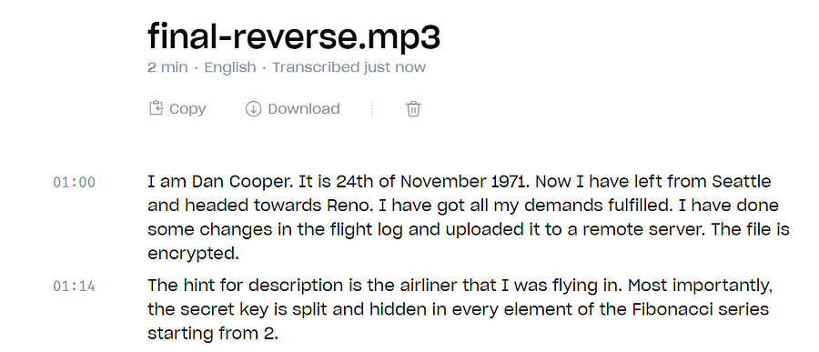
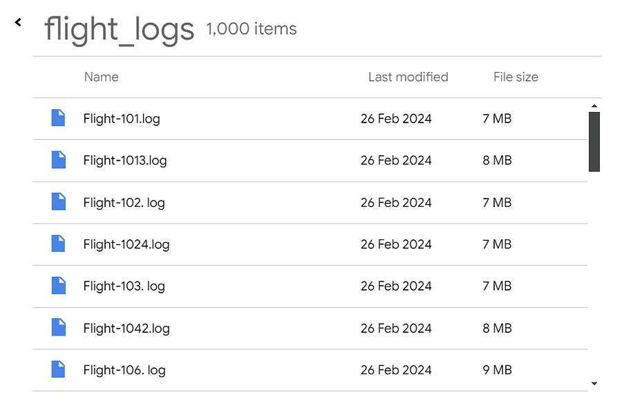

# Mysterious Old Case
`Difficulty: Medium`

**DESCRIPTION** 
You as a FBI Agent, are working on a old case involving a ransom of $200,000. After some digging you recovered an audio recording.

Author : Abhishek Mallav

FLAG FORMAT: `VishwaCTF{}`

## Solution:
we got the `.mp3` file which i played and found nothing then after multiple timmes of playing i got to know that the audio file is reversed

So i used the online tool to reverse the audio and then i used online tool to get transcript of the audio file and i got this

So i searched on web and found it was the details regarding case related to D.B Cooper, a famous plane hijack

after seeing the metadata of the given `.mp3` file i got one google drive link

`https://drive.google.com/file/d/1bkuZRLKOGWB7tLNBseWL34BoyI379QbF/view`

and hint for the password of the zip file was mentioned in the audio message 
password: `northwestorientairlines`

in this there were 1000 files, so from the google i got the flight number that is `Flight-305` and checked logs for that and sorting them in fibonacci series staring from 2 (as mentioned in the audio file) i got the flag

### Flag:
`FLAG: VishwaCTF{1_W!LL_3E_B@CK}`

