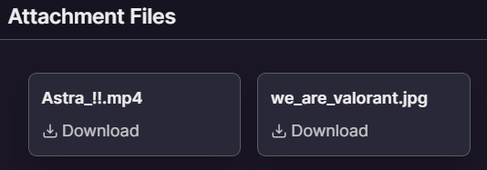
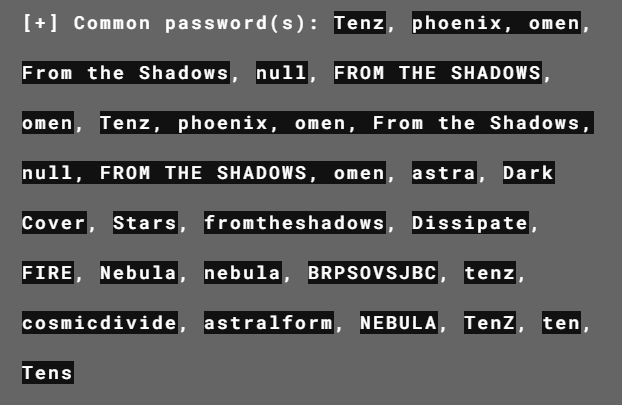
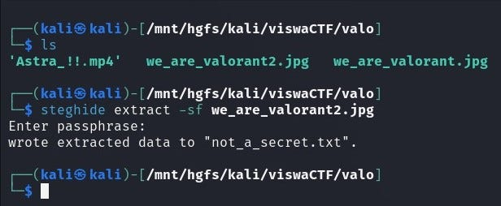
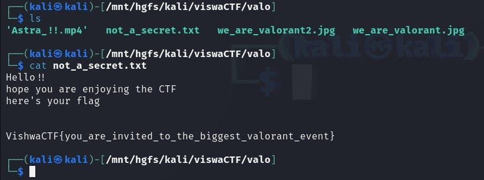

# We Are Valorant 
`Difficulty: Easy`

**DESCRIPTION** 
One day, while playing Valorant, I received a mail from Riot Games that read,

“In a world full of light, sometimes the shadows help you win.” “Your Signature move also helps you a lot ; develop one and ace it now.”

It also had an image and a video/gif attached to it. I am not able to understand what they want to say. Help me find what the message wants to express.

Author : Abhinav Mehta

FLAG FORMAT: `VishwaCTF{}`

## Solution:
The `.jpg` file we got was 

So, after fixing the `.jpg` file i got image which i checked in [`Aperisolve`](https://www.aperisolve.com/) and from there i got the password

after using `Tenz` as a password i extracted the file and got this file "`not_a_secret.txt`"

after seeing the file i got the flag

### Flag:
`VishwaCTF{you_are_invited_to_the_biggest_valorant_event}`

