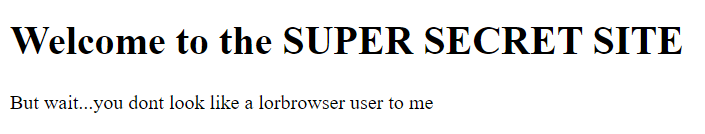
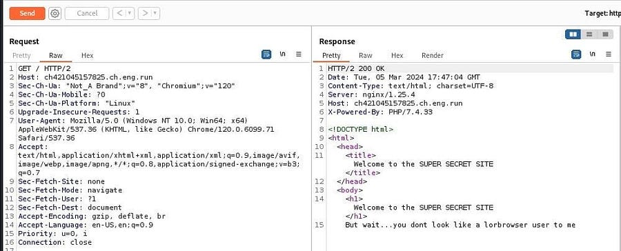
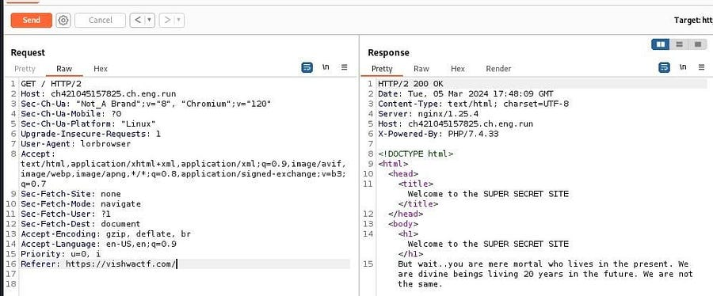
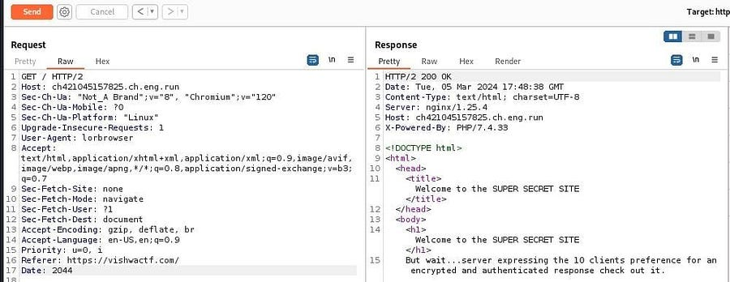
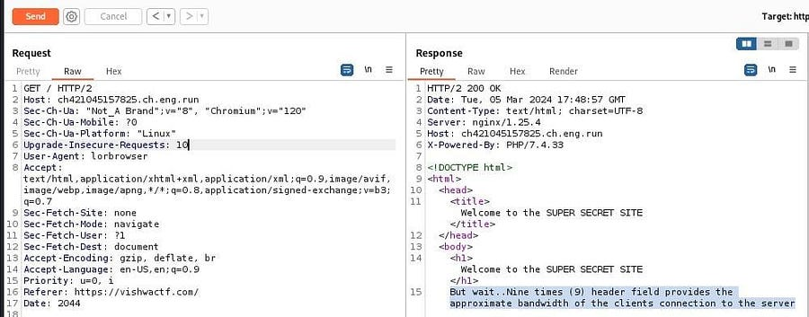
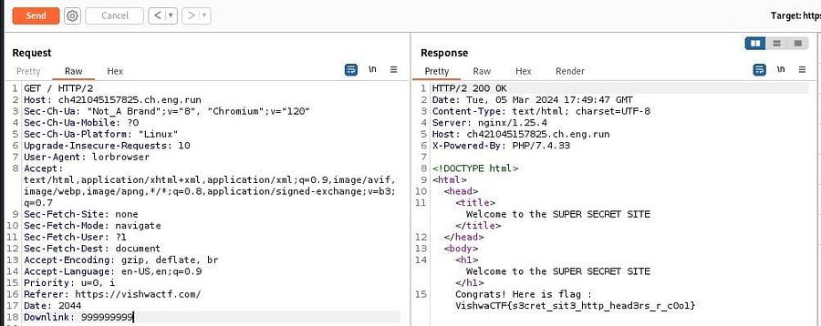

# H34D3RS 
`Difficulty:Easy`

**DESCRIPTION** 
Name of the challenge says something.

Author : Samarth Kamble

FLAG FORMAT: `VishwaCTF{}`

## Solution:

It was a challenge about Headers

To solve this challenge i followed the instruction provided and proceeded...

changed the user agent to lorbrowser 
`User-agent: lorbrowser`
  

changed referer to vishwactf.com 
`Referer: https://vishwactf.com/`
  

set the date to 20 years from now 
`Date: 2044` 
  

updated the request from 1 to 10 
`upgrade-insecure-requests: 10`
  

set the downtime to nine times 9 
`Downtime: 999999999`
  

by doing all these i got the flag

### Flag:
`VishwaCTF{s3cret_sit3_http_head3rs_r_c0o1}`

