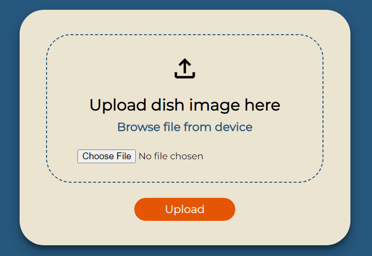
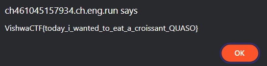

# Recipe Archival Workshop
`Difficulty: Easy`

**DESCRIPTION**<br>
New interns in the Recipe Archival Workshop have a simple task- upload images of yummy delicacies and dream about tasting them some day.

Author : Amruta Patil

FLAG FORMAT: `VishwaCTF{}`



## Solution:

I tried uploading many image file format from this
```
JPEG (or JPG) - Joint Photographic Experts Group
PNG - Portable Network Graphics
GIF - Graphics Interchange Format
TIFF - Tagged Image File
PSD - Photoshop Document
PDF - Portable Document Format
EPS - Encapsulated Postscript
AI - Adobe Illustrator Document
INDD - Adobe Indesign Document
RAW - Raw Image Formats
```
and when i uploaded file with `.tiff` extension
(it will work with both working or non-working file just extension should be .tiff)


i got this alert message and got the flag



### Flag:
`VishwaCTF{today_i_wanted_to_eat_a_croissant_QUASO}`