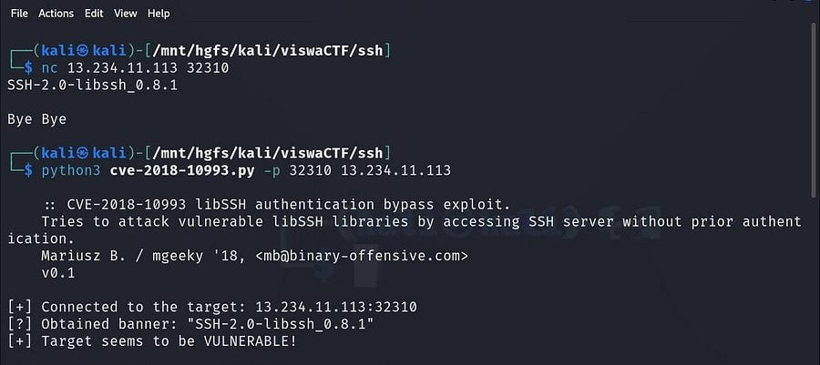
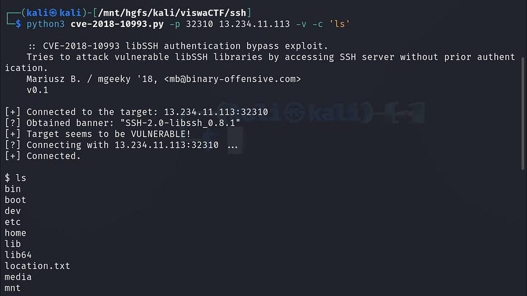
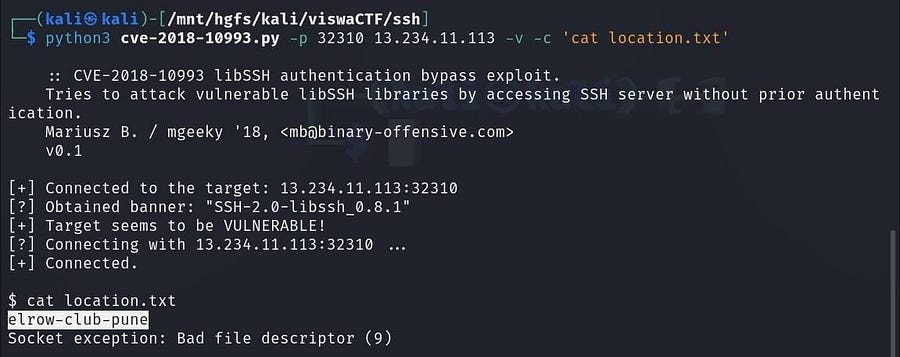

# Save The City
`Difficulty: Easy`

**DESCRIPTION** 
The RAW Has Got An Input That ISIS Has Planted a Bomb Somewhere In The Pune! Fortunetly, RAW Has Infiltratrated The Internet Activity of One Suspect And They Found This Link. You Have To Find The Location ASAP!

Aurthor : Samarth Ghante & Harshali Patil

FLAG FORMAT: `VishwaCTF{}`

## Solution:

Starting with netcat i got this `SSH-2.0-libssh_0.8.1`

After searching on google i found `CVE libSSH authentication bypass exploit` and got [this]() script

After running this script with portnumber and ip i got this 
`python3 {filename} -p {port} {ip}`

then after listing the files we got `location.txt`

seeing location.txt we get the location

location: `elrow-club-pune`

### Flag:
`VishwaCTF{elrow-club-pune}`
