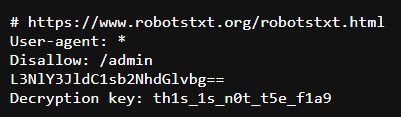
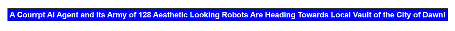
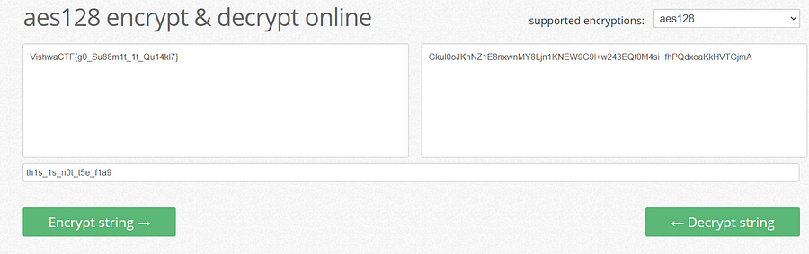

# They Are Coming
`Difficulty: Easy`

**DESCRIPTION**<br>
Aesthetic Looking army of 128 Robots with AGI Capabilities are coming to destroy our locality!

Author : Samarth Ghante

FLAG FORMAT: `VishwaCTF{}`


## Solution:

After seeing the instance website i checked the route `robots.txt` and i got this



```
# https://www.robotstxt.org/robotstxt.html
User-agent: *
Disallow: /admin
L3NlY3JldC1sb2NhdGlvbg==
Decryption key: th1s_1s_n0t_t5e_f1a9
```
after converting `L3NlY3JldC1sb2NhdGlvbg==` base 64 i got this route

`/secret-location`

after checking this route i got this



from this i figured out the decryption technique i.e `128 AES` (after lots of struggle)

and from the local vault word i got an idea to check `local storage` of a website and i got this


`Gkul0oJKhNZ1E8nxwnMY8Ljn1KNEW9G9l+w243EQt0M4si+fhPQdxoaKkHVTGjmA`

after using this as an ciphertext and key from the route `/robots.txt`
i used [this](https://encode-decode.com/aes128-encrypt-online/) site to get the flag



### Flag:
`VishwaCTF{g0_Su88m1t_1t_Qu14kl7}`

